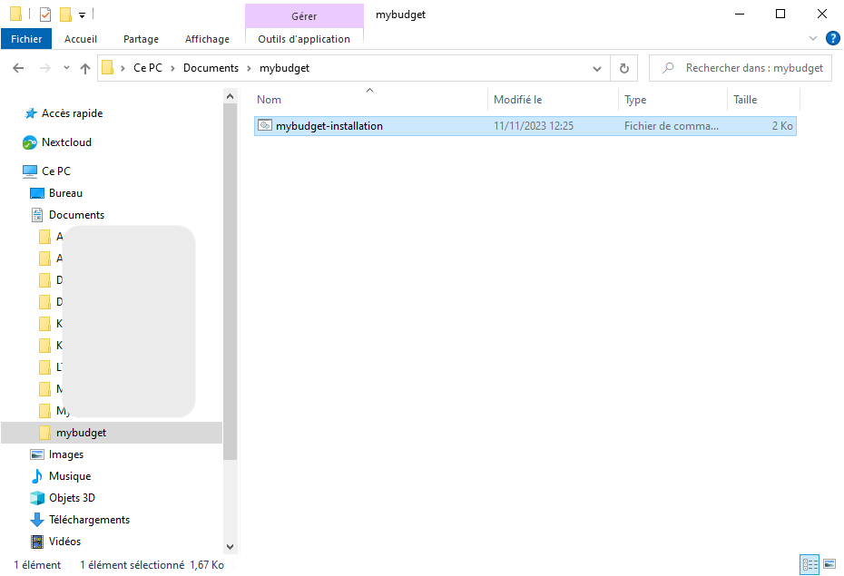
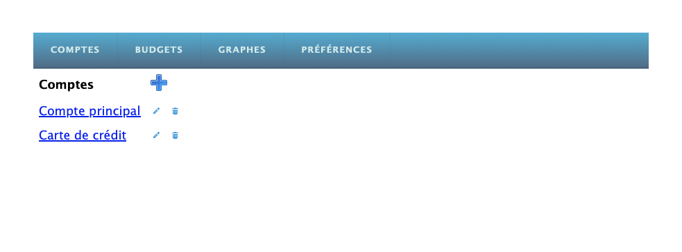

# Installation

## Windows 10

### Installation de Python

Aller sur le site de Python: https://www.python.org et télécharger le module d'installation pour Windows. Prendre la version stable et lancer l'installation avec les options par défaut.

### Téléchargement et installation

A partir de https://github.com/pvezid/mybudget

* Cliquez sur le lien mybudget-installation.bat

* Puis cliquez sur le symbôle de téléchargement sur la droite de la page pour télécharger le script.

* A l'aide de l'explorateur de fichier, créez un sous-dossier mybudget dans votre dossier Documents.
* Déplacez le script d'installation dans ce sous-dossier, il est indispensable de créer un sous-dossier: le script d'installation doit être le seul fichier du dossier avant installation.

* Avec l'explorateur de fichier, faites un double click sur le script d'installation pour le lancer. Il va s'exécuter pendant quelques minutes pour télécharger l'appli, l'installer et créer un raccourci sur le bureau pour pouvoir la lancer.

### Lancement

* Lancer le raccourci mybudget à partir du bureau.
* Lancer un navigateur web et se connecter sur la page: http://localhost:8000/budget
* Créer éventuellement un favori sur cette page pour simplifier l'accès.

Si votre navigateur affiche cette page, tout est prêt !

Il ne vous reste plus qu'à tester la prise en main rapide: [Prise en main](assets/mybudget-Prise-en-main.pdf)
